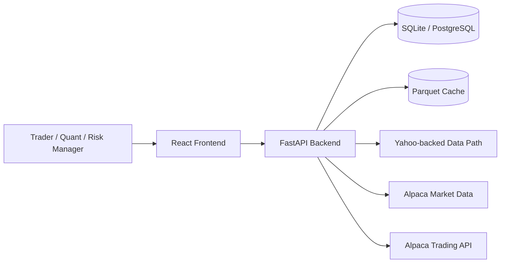
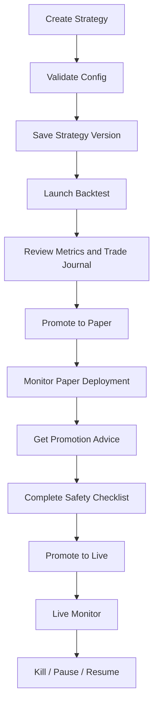

# UltraTrader 2026 Agent Rebuild Blueprint

Verified against the codebase on April 10, 2026.

Purpose: this is the single handoff file for any agent that needs to recreate, extend, or visually match the current UltraTrader 2026 system.

It combines PRD, site diagram, CSS/design rules, domain schemas, API surface, UX backlog, and free data-source options.

## 1. Product Definition

### 1.1 Product Summary

UltraTrader 2026 is a full-stack trading operations platform built around one continuous workflow:

`Idea -> Strategy Definition -> Backtest -> Review -> Paper Deployment -> Live Promotion -> Monitoring -> Kill / Resume`

It is not just a backtester. It is an operator console for turning rule-based strategies into supervised deployments with visible risk state.

### 1.2 Core Jobs To Be Done

1. Define strategy logic without editing engine code.
2. Run no-lookahead backtests with explicit fill assumptions.
3. Review performance using metrics, charts, trade logs, and Monte Carlo outputs.
4. Promote approved versions into paper trading without rewriting strategy logic.
5. Promote paper deployments into live trading only through explicit safety checks.
6. Monitor accounts, positions, orders, and deployment health in one place.
7. Stop trading instantly via global or scoped controls.
8. Reuse locally cached market data instead of downloading it repeatedly.

### 1.3 Non-Negotiable Product Principles

- Safety must be more visually obvious than growth.
- Backtest, paper, and live modes must never feel interchangeable.
- The UI should feel like a trading workstation, not a retail finance app.
- Strategy logic must be inspectable and explainable.
- Promotion to live must feel gated, intentional, and auditable.
- Data reuse and cache visibility are first-class features.

### 1.4 Intended Users

| User | What they need most |
| --- | --- |
| Quant hobbyist | Fast idea-to-backtest loop, rich configuration, local data reuse |
| Active trader | Monitoring, deployment control, quick position awareness, kill controls |
| Small desk / operator | Multiple accounts, promotion workflow, credentials, auditability |
| Risk manager | Obvious live state, account limits, stop/resume controls, event awareness |

## 2. As-Built System Snapshot

### 2.1 Current Stack

Frontend:
- React 18
- TypeScript
- Vite 5
- Tailwind CSS 3
- TanStack Query v5
- Zustand
- Recharts
- React Router v6

Backend:
- FastAPI 0.111
- SQLAlchemy 2.0
- Pydantic 2
- SQLite local by default, PostgreSQL-ready
- Async I/O with `aiosqlite`
- Structlog for structured logging

Trading/Data:
- Yahoo-backed `yfinance`/`yahooquery` path for free data
- Alpaca market/trading integration
- Parquet cache for historical bars
- Declarative JSON/YAML strategy configs

Ops:
- Docker Compose
- Frontend nginx container
- Backend health check
- Seeded paper account and sample strategies on startup

### 2.2 Current App Shell

The existing UI is compact, dark, mono-typographic, and operator-first:

- Left sidebar navigation
- Thin top header
- Persistent mode indicator in header
- Persistent kill switch in header
- Main content area with card-based panels
- Tables and charts styled for dense scanning

### 2.3 Current Route Map

| Route | Page |
| --- | --- |
| `/` | Dashboard |
| `/strategies` | Strategy list |
| `/strategies/new` | Strategy creator |
| `/strategies/:strategyId` | Strategy details |
| `/backtest` | Backtest launcher |
| `/runs` | Run history |
| `/runs/:runId` | Run details |
| `/accounts` | Account monitor |
| `/security` | Credential manager |
| `/deployments` | Deployment manager |
| `/monitor` | Live monitor |
| `/data` | Data manager |
| `/events` | Event calendar |
| `/logs` | Logs panel |

## 3. PRD

### 3.1 Vision

Create a production-grade trading workstation that makes the full strategy lifecycle operationally safe, visually legible, and fast to iterate.

### 3.2 Goals

1. Unify strategy creation, testing, deployment, and monitoring into one product.
2. Keep strategy logic data-driven and portable across backtest, paper, and live.
3. Make live-state risk impossible to miss.
4. Let operators compare performance before capital is exposed.
5. Preserve an audit trail for deployment and control actions.

### 3.3 Non-Goals

- Not a social trading app.
- Not a broker replacement or full institutional OMS in v1.
- Not a black-box autonomous AI trader.
- Not options-first in the current build.

### 3.4 Functional Scope

| Module | Current State | Must Preserve In Rebuild |
| --- | --- | --- |
| Dashboard | Implemented | KPI cards, status banners, recent runs, account equity view |
| Strategy Studio | Implemented | Visual config builder, validation, save-to-version model |
| Backtesting | Implemented | Launch, run history, detailed run review, promotion entry point |
| Accounts | Implemented | Paper/live accounts, risk limits, kill/resume, delete blockers |
| Credentials | Implemented | Store/update/validate Alpaca creds |
| Deployments | Implemented | Paper promotion, live promotion, safety checklist, pause/start/stop |
| Live Monitor | Implemented | Open positions, open orders, multi-run tabbing, close actions |
| Data Vault | Implemented | Provider choice, symbol search, cache inventory, deletion |
| Event Calendar | Implemented | Manual/sample events and filter concepts |
| Kill Switch / Logs | Implemented | Global kill, scoped kill/pause/resume events |
| ML Promotion Advice | Implemented | Recommendation endpoint for paper->live promotion |

### 3.5 Operational Assumptions

These trading assumptions are critical and should not be silently changed:

- Signals fire on bar close.
- Fills occur on next bar open.
- Slippage is explicit and configurable.
- Commission is explicit and configurable.
- Intrabar high/low checks are used for stop/target evaluation.
- Gap-through-stop behavior is modeled conservatively.
- No-lookahead behavior is expected throughout indicator use.

## 4. System Diagram



### 4.1 Promotion Flow



## 5. Site Diagram

### 5.1 Information Architecture

```text
UltraTrader Shell
|- Header
|  |- Mode Indicator
|  |- Kill Switch
|- Sidebar
|  |- Dashboard
|  |- Strategies
|  |- Backtest
|  |- Run History
|  |- Live Monitor
|  |- Accounts
|  |- Security
|  |- Deploy
|  |- Data
|  |- Events
|  |- Logs
|- Content
   |- Overview pages
   |- Detail pages
   |- Wizards
   |- Tables
   |- Charts
   |- Action panels
```

### 5.2 Primary User Journeys

Strategy flow:
- `Strategies -> New Strategy -> Validate -> Save -> Strategy Details`

Backtest flow:
- `Backtest -> Select strategy/version -> Set symbols/timeframe/dates -> Launch -> Run Details`

Paper promotion flow:
- `Run Details -> Promote -> Select paper account -> Create deployment`

Live promotion flow:
- `Deployments -> Select paper deployment -> ML advice -> Complete checklist -> Promote to live`

Monitoring flow:
- `Dashboard or Live Monitor -> Open deployment tab -> Inspect positions/orders -> Close or stop if needed`

Data flow:
- `Data -> Choose provider -> Search symbols -> Configure range/timeframe -> Download -> Cache inventory`

## 6. UX And Visual Direction

### 6.1 Experience Target

The product should feel like:
- a trading console
- calm under stress
- dense but readable
- serious, not flashy
- high-trust during critical actions

It should not feel like:
- consumer fintech
- pastel SaaS
- crypto casino UI
- mobile-only design stretched onto desktop

### 6.2 Visual Rules

1. Use a near-black background with slightly lighter cards and rails.
2. Use mono or mono-adjacent typography globally.
3. Keep the layout compact and edge-efficient.
4. Live mode must use a visibly dangerous accent.
5. Positive P&L should read green, negative P&L red, neutral gray.
6. Tables should be dense, sortable-looking, and scan-friendly.
7. Charts should favor clarity over decoration.
8. Critical actions should be visually separated from routine actions.

### 6.3 Interaction Rules

- Header mode state is always visible.
- Kill actions are always discoverable.
- Promotion actions must require deliberate confirmation.
- Empty states should teach next steps.
- Error states should show cause and the next likely fix.
- Dense inputs are acceptable, but sectioning must be strong.

### 6.4 Copy Tone

- terse
- operational
- unambiguous
- no hype language during risk-sensitive actions

Examples:
- Good: `Promote to Paper Trading`
- Good: `Close ALL positions for this run?`
- Bad: `Launch this alpha rocket`

## 7. CSS / Design System Specification

### 7.1 Core Tokens

```css
:root {
  --bg-page: #030712;
  --bg-panel: #111827;
  --bg-elevated: #1f2937;
  --border-subtle: #1f2937;
  --border-default: #374151;

  --text-primary: #f3f4f6;
  --text-secondary: #d1d5db;
  --text-muted: #9ca3af;
  --text-faint: #6b7280;

  --brand: #0284c7;
  --brand-hover: #0ea5e9;
  --brand-soft: #38bdf8;

  --success: #34d399;
  --success-bg: #064e3b;

  --danger: #f87171;
  --danger-strong: #dc2626;
  --danger-bg: #7f1d1d;
  --danger-banner: #450a0a;

  --warning: #fbbf24;
  --warning-strong: #d97706;

  --paper: #a5b4fc;
  --paper-bg: #312e81;

  --radius-sm: 6px;
  --radius-md: 8px;
  --radius-lg: 12px;

  --shadow-panel: 0 10px 24px rgba(0, 0, 0, 0.18);
}
```

### 7.2 Typography

```css
body {
  font-family: ui-monospace, SFMono-Regular, Menlo, Monaco, Consolas, monospace;
  background: var(--bg-page);
  color: var(--text-primary);
}

.h1 { font-size: 24px; font-weight: 700; letter-spacing: -0.02em; }
.h2 { font-size: 16px; font-weight: 600; }
.h3 { font-size: 14px; font-weight: 600; }
.label { font-size: 11px; text-transform: uppercase; letter-spacing: 0.08em; color: var(--text-muted); }
.body-sm { font-size: 12px; color: var(--text-secondary); }
.mono-number { font-variant-numeric: tabular-nums; }
```

### 7.3 Layout Rules

- Sidebar width: `224px`
- Header height: `48px`
- Main content padding: `16px`
- Card padding: `16px`
- Grid gaps: `12px` or `16px`
- Tables use tight row heights and mono numeric values

### 7.4 Component Recipes

Cards:

```css
.card {
  background: var(--bg-panel);
  border: 1px solid var(--border-subtle);
  border-radius: var(--radius-md);
  box-shadow: var(--shadow-panel);
}
```

Buttons:

```css
.btn-primary { background: var(--brand); color: white; }
.btn-primary:hover { background: var(--brand-hover); }

.btn-danger { background: var(--danger-strong); color: white; }
.btn-danger:hover { filter: brightness(1.08); }

.btn-ghost {
  background: transparent;
  border: 1px solid var(--border-default);
  color: var(--text-secondary);
}
```

Badges:

```css
.badge-backtest { background: var(--success-bg); color: #6ee7b7; }
.badge-paper { background: var(--paper-bg); color: var(--paper); }
.badge-live { background: var(--danger-bg); color: #fca5a5; }
```

Inputs:

```css
.input {
  background: var(--bg-elevated);
  border: 1px solid var(--border-default);
  color: var(--text-primary);
  border-radius: var(--radius-sm);
}
.input:focus {
  outline: none;
  border-color: var(--brand-hover);
}
```

Mode indicator:
- Backtest: green
- Paper: indigo
- Live: red + pulse

Kill switch:
- Resting state: dark red button
- Triggered state: flashing red message plus resume action

### 7.5 Chart Palette

Use this order for consistent charting:

```text
#10b981
#3b82f6
#f59e0b
#8b5cf6
#ef4444
#06b6d4
```

### 7.6 Motion Rules

- Only animate what signals state change.
- Good motion: live pulse, loading spinner, active-run dot.
- Bad motion: decorative drifting backgrounds, excessive hover transforms.

## 8. Page Schemas

### 8.1 Dashboard

Purpose:
- single-pane system summary

Must include:
- total equity
- active deployments
- recent backtest returns
- kill-switch state
- account equity allocation
- recent runs and deployment snippets

Critical states:
- global kill banner
- backend/data refresh status

### 8.2 Strategies

Purpose:
- browse and manage strategies and versions

Must include:
- strategy cards or table
- category/status visibility
- create-new CTA
- version awareness

### 8.3 Strategy Creator

Purpose:
- build strategy config visually

Sections:
- strategy info
- universe & timeframe
- entry rules
- stop loss
- targets
- position sizing
- risk controls
- regime filter
- cooldown rules
- scale out / scale in

Must preserve:
- N-of-M logic options
- condition list editing
- inline validate action
- save action

### 8.4 Backtest Launcher

Purpose:
- configure and launch a backtest quickly

Sections:
- strategy/version selector
- symbol list
- timeframe/date range
- capital/commission/slippage
- intraday limits warning

### 8.5 Run History

Purpose:
- browse prior backtests

Must include:
- status
- return
- sharpe
- drawdown
- trade count
- timestamp

### 8.6 Run Details

Tabs:
- Overview
- Equity & Drawdown
- Trade Journal
- Monthly Returns
- Monte Carlo
- Promote

Must include:
- KPI grid
- exit-reason breakdown
- regime breakdown
- equity curve
- drawdown chart
- monthly heatmap
- trade log
- paper-promotion panel

### 8.7 Account Monitor

Purpose:
- manage accounts and review account-level constraints

Must include:
- account cards
- mode/state badges
- equity/cash/P&L
- risk limits
- activity summary
- delete blockers
- kill/resume/edit/refresh actions

### 8.8 Credential Manager

Purpose:
- manage broker API credentials

Must include:
- paper/live key sets
- show/hide values
- validate/test connection
- save encrypted config

### 8.9 Deployment Manager

Purpose:
- operate paper/live deployment lifecycle

Must include:
- deployment table
- start/pause/stop controls
- live promotion panel
- 5-item safety checklist
- notes
- promotion advice callout

### 8.10 Live Monitor

Purpose:
- monitor active paper/live runs in near real time

Must include:
- run list
- multi-tab open state
- account stat pills
- positions table
- orders table
- close-position and close-all actions

### 8.11 Data Manager

Purpose:
- fetch and inspect market data cache

Must include:
- provider selection step
- symbol search
- provider-aware constraints
- date/timeframe config
- review step
- inventory table
- cache delete / refresh

### 8.12 Event Calendar

Purpose:
- track market events and seed blackout data

Must include:
- category, impact, source, event time
- sample seeding
- future filter compatibility

### 8.13 Logs

Purpose:
- audit control events and operator actions

Must include:
- kill, pause, resume history
- timestamp, reason, scope, actor

## 9. Domain Schemas

### 9.1 Strategy Config Schema

This is the portable heart of the system. Rebuild around this shape, not around page-local form state.

```yaml
symbols: [SPY, QQQ]
timeframe: 1d

entry:
  directions: [long, short]
  logic: all_of
  conditions:
    - type: single
      left: { field: close }
      op: ">"
      right: { indicator: ema_21 }

stop_loss:
  method: atr_multiple
  period: 14
  mult: 2.0

targets:
  - method: r_multiple
    r: 1.0
  - method: r_multiple
    r: 2.0

position_sizing:
  method: risk_pct
  risk_pct: 1.0

regime_filter:
  allowed: [trending_up]

cooldown_rules:
  - trigger: stop_out
    duration_minutes: 60

scale_out:
  move_stop_to_be_after_t1: true
  levels:
    - { pct: 50 }
    - { pct: 50 }

risk:
  max_position_size_pct: 0.10
  max_daily_loss_pct: 0.03
  max_drawdown_lockout_pct: 0.10
  max_open_positions: 10
  max_portfolio_heat: 0.06
```

### 9.2 Condition Schema

Supported condition forms:

```json
{ "type": "single", "left": { "field": "close" }, "op": ">", "right": { "indicator": "ema_21" } }
{ "type": "all_of", "conditions": [] }
{ "type": "any_of", "conditions": [] }
{ "type": "n_of_m", "n": 4, "conditions": [] }
{ "type": "not", "condition": {} }
{ "type": "regime_filter", "allowed": ["trending_up"] }
```

Operators:
- `>`
- `>=`
- `<`
- `<=`
- `==`
- `!=`
- `crosses_above`
- `crosses_below`
- `between`
- `in`

### 9.3 Database Schema Summary

| Table | Purpose | Core Fields |
| --- | --- | --- |
| `strategies` | strategy metadata | `id`, `name`, `description`, `category`, `status`, `tags`, timestamps |
| `strategy_versions` | immutable config snapshots | `id`, `strategy_id`, `version`, `config`, `notes`, `promotion_status`, `promoted_from_run_id` |
| `backtest_runs` | run configuration + status | `id`, `strategy_version_id`, `mode`, `status`, `symbols`, `timeframe`, dates, capital, commission, slippage |
| `run_metrics` | run analytics | returns, sharpe/sortino/calmar, drawdown, trade stats, `monthly_returns`, `equity_curve`, `exit_reason_breakdown`, `regime_breakdown`, `monte_carlo` |
| `trades` | trade journal | symbol, direction, entry/exit details, P&L, `return_pct`, `r_multiple`, `regime_at_entry`, `entry_conditions_fired` |
| `scale_events` | scale-in/out detail | trade link, event type, time, price, quantity, reason |
| `accounts` | paper/live account state | balances, risk limits, broker mode, encrypted config, kill state, symbol allow/block lists |
| `deployments` | running strategy/account assignments | strategy ids, account id, mode, status, config overrides, stop reason, promotion lineage |
| `deployment_approvals` | approval history | from/to mode, notes, safety checklist |
| `market_events` | event calendar | name, category, symbol, event time, impact, source |
| `event_filters` | per-strategy event windows | categories, impact levels, before/after window, disable entries, reduce size, close-before rules |
| `data_inventory` | cached data index | symbol, timeframe, source, date span, row count, file path |
| `cached_bars` | optional row-level bar store | symbol, timeframe, timestamp, OHLCV |
| `kill_switch_events` | audit trail | scope, scope id, action, reason, triggered_by, timestamp |

## 10. API Specification

All routes are mounted under `/api/v1`.

### 10.1 Strategies

| Method | Endpoint | Purpose |
| --- | --- | --- |
| `GET` | `/strategies` | list strategies |
| `POST` | `/strategies` | create strategy + initial version |
| `GET` | `/strategies/{strategy_id}` | get strategy with versions |
| `PUT` | `/strategies/{strategy_id}` | update strategy metadata |
| `DELETE` | `/strategies/{strategy_id}` | delete strategy |
| `POST` | `/strategies/{strategy_id}/versions` | create new version |
| `GET` | `/strategies/{strategy_id}/versions/{version_id}` | get one version |
| `POST` | `/strategies/validate` | validate config |

### 10.2 Backtests

| Method | Endpoint | Purpose |
| --- | --- | --- |
| `POST` | `/backtests/launch` | launch background backtest |
| `GET` | `/backtests` | list runs |
| `GET` | `/backtests/{run_id}` | get one run |
| `GET` | `/backtests/{run_id}/equity-curve` | fetch curve data |
| `GET` | `/backtests/{run_id}/trades` | fetch trade journal |
| `POST` | `/backtests/{run_id}/compare` | compare runs |
| `PUT` | `/backtests/{run_id}` | update run metadata |
| `DELETE` | `/backtests/{run_id}` | delete run |

### 10.3 Accounts / Credentials

| Method | Endpoint | Purpose |
| --- | --- | --- |
| `GET` | `/accounts` | list accounts |
| `POST` | `/accounts` | create account |
| `GET` | `/accounts/{account_id}` | get account |
| `PUT` | `/accounts/{account_id}` | update account |
| `DELETE` | `/accounts/{account_id}` | delete account |
| `POST` | `/accounts/{account_id}/kill` | kill account |
| `POST` | `/accounts/{account_id}/resume` | resume account |
| `GET` | `/accounts/{account_id}/credentials` | read credential wrapper |
| `PUT` | `/accounts/{account_id}/credentials` | update credentials |
| `POST` | `/accounts/{account_id}/credentials/validate` | validate broker connection |
| `GET` | `/accounts/{account_id}/broker/status` | account/broker status |
| `POST` | `/accounts/{account_id}/refresh` | refresh balances from broker |
| `GET` | `/accounts/{account_id}/broker/orders` | list broker orders |

### 10.4 Deployments

| Method | Endpoint | Purpose |
| --- | --- | --- |
| `GET` | `/deployments` | list deployments |
| `POST` | `/deployments/promote-to-paper` | create paper deployment |
| `POST` | `/deployments/promote-to-live` | create live deployment |
| `GET` | `/deployments/{deployment_id}` | get deployment |
| `POST` | `/deployments/{deployment_id}/start` | start deployment |
| `POST` | `/deployments/{deployment_id}/pause` | pause deployment |
| `POST` | `/deployments/{deployment_id}/stop` | stop deployment |
| `PUT` | `/deployments/{deployment_id}` | update deployment |
| `DELETE` | `/deployments/{deployment_id}` | delete deployment |
| `GET` | `/deployments/{deployment_id}/positions` | current positions |

### 10.5 Monitor

| Method | Endpoint | Purpose |
| --- | --- | --- |
| `GET` | `/monitor/runs` | list live/paper runs |
| `GET` | `/monitor/runs/{deployment_id}` | run detail |
| `GET` | `/monitor/runs/{deployment_id}/positions` | open positions |
| `GET` | `/monitor/runs/{deployment_id}/orders` | open orders |
| `POST` | `/monitor/runs/{deployment_id}/close-position` | flatten one symbol |
| `POST` | `/monitor/runs/{deployment_id}/close-all` | flatten all |
| `GET` | `/monitor/accounts` | monitoring-oriented account list |

### 10.6 Data

| Method | Endpoint | Purpose |
| --- | --- | --- |
| `GET` | `/data/providers` | provider metadata |
| `GET` | `/data/inventory` | list cached datasets |
| `GET` | `/data/inventory/{symbol}/{timeframe}` | one cached dataset |
| `POST` | `/data/fetch` | fetch one dataset |
| `POST` | `/data/fetch-many` | fetch batch |
| `DELETE` | `/data/cache/{symbol}/{timeframe}` | delete cache file |
| `GET` | `/data/search` | symbol search |

### 10.7 Events / Control / ML / BI

| Method | Endpoint | Purpose |
| --- | --- | --- |
| `GET` | `/events` | list events |
| `POST` | `/events` | create event |
| `POST` | `/events/seed-sample` | seed sample macro events |
| `GET` | `/events/filters` | list event filters |
| `POST` | `/events/filters` | create event filter |
| `GET` | `/control/status` | global kill status + platform mode |
| `POST` | `/control/kill-all` | global kill |
| `POST` | `/control/resume-all` | global resume |
| `POST` | `/control/kill-strategy/{strategy_id}` | scoped strategy kill |
| `POST` | `/control/pause-strategy/{strategy_id}` | scoped strategy pause |
| `POST` | `/control/resume-strategy/{strategy_id}` | scoped strategy resume |
| `GET` | `/control/kill-events` | audit log |
| `POST` | `/ml/promote-advice` | paper->live recommendation |
| `GET` | `/bi/overview` | BI summary endpoint |

## 11. Rebuild Rules For Another Agent

### 11.1 Preserve Exactly

- Dark shell with left rail + top risk header
- Global mode indicator in the header
- Global kill switch in the header
- Mono-heavy typography
- Strategy config as a versioned JSON/YAML object
- Run details with the same six-tab mental model
- Paper-to-live promotion gate with checklist
- Data manager as a wizard, not a flat form
- Backtest assumptions around bar-close/next-open logic

### 11.2 Safe Simplifications

- Component internals can be refactored.
- State management can be re-organized.
- Chart library can change only if the visual output remains dense and clear.
- API implementation details can evolve if route contracts remain compatible.

### 11.3 Unsafe Simplifications

- Removing explicit mode styling differences
- Hiding kill controls deep inside settings
- Flattening Strategy Creator into an unsectioned form
- Replacing run detail tabs with a single long scroll page
- Treating paper and live promotion as the same action
- Turning cached data inventory into an invisible backend-only concern

### 11.4 Recommended Build Order

1. App shell and design tokens
2. Domain types and API client contracts
3. Dashboard and navigation
4. Strategy Studio
5. Backtest launcher and run details
6. Accounts and credentials
7. Deployments and live promotion workflow
8. Live monitor
9. Data manager and cache inventory
10. Events, logs, and hardening

## 12. UX + Trading Guru Backlog

### P0: High Impact

1. Replace the current one-click kill confirm with a structured modal that captures scope, reason, and optional flatten policy.
2. Add a persistent live-session banner whenever any live deployment is running, not just when platform mode is `live`.
3. Add strategy YAML/JSON preview in Strategy Creator before save.
4. Add version diffing between strategy versions.
5. Add an explicit assumptions panel on Backtest Launcher so users see fill timing, slippage, commissions, and stop/target resolution rules before launch.
6. Add a run-comparison view for two or more backtests with shared KPI and equity overlays.
7. Add deployment readiness scoring in Run Details before paper promotion.
8. Add audit reasons and operator identity to every destructive action in the UI.

### P1: Strong UX Gains

9. Add chart-backed strategy rule previews so entry/exit conditions can be visualized on sample candles.
10. Add event-aware risk warnings when a live deployment is open within a configured blackout window.
11. Add a "flatten account" control separate from global kill.
12. Add real deployment health badges: broker connected, orders stale, positions desynced, data lagging.
13. Add watchlist / market context widgets on the Dashboard for active symbols.
14. Add saved backtest presets for date range, symbols, and execution parameters.
15. Add bulk account actions where operationally safe.

### P2: Trading Intelligence Extensions

16. Add walk-forward optimization and out-of-sample split visualization.
17. Add regime-tagged performance drilldowns by symbol, session, and volatility bucket.
18. Add support/resistance and fair-value-gap visual helpers in the strategy editor.
19. Add a deployment replay timeline combining signals, fills, orders, kills, and manual actions.
20. Add options and multi-leg order support only after the risk and approval model is upgraded.

## 13. Free Data Download Options

Verified on April 10, 2026. This section mixes:
- current in-product options already reflected in code
- additional free or free-entry providers worth integrating next

### 13.1 Current In-Product Providers

| Provider | Status In Product | Best Use | Notes |
| --- | --- | --- | --- |
| Yahoo-backed `yfinance` path | Implemented | free daily/weekly backtests, light intraday | No credentials; code enforces Yahoo-style intraday limits |
| Alpaca | Implemented | broker-aligned US equity data and live workflows | Requires API credentials; best for broker-consistent deployments |

### 13.2 Additional Free Or Free-Entry Providers Worth Adding

| Provider | What It Is Good For | Free Access Shape | Integration Fit | Official Link |
| --- | --- | --- | --- | --- |
| Alpha Vantage | equities, ETF, forex, crypto, macro, indicators | free API key with up to 25 requests/day, CSV/JSON response patterns | good fallback provider for low-volume research and macro overlays | https://www.alphavantage.co/documentation/ |
| Twelve Data | real-time US equities/ETFs, forex, crypto, indicators, batch requests | free Basic tier currently shows 8 API credits per minute and 800/day for personal non-commercial use | strong candidate for symbol search, intraday fallback, batch fetch UX | https://twelvedata.com/pricing |
| Financial Modeling Prep | stock EOD/intraday, forex, crypto, fundamentals | free plan currently states up to 250 market-data requests/day | very good for fundamentals, calendars, and extra market datasets | https://site.financialmodelingprep.com/faqs |
| FRED API | macro and economic time series | free registered API key; JSON, CSV, XLSX paths for observations | ideal for regime filters, macro dashboards, CPI/Fed/NFP context | https://fred.stlouisfed.org/docs/api/fred/series_observations.html |
| SEC EDGAR APIs | filings, company facts, XBRL fundamentals | no API key required for `data.sec.gov`; bulk ZIP downloads available | ideal for event intelligence, filing calendars, and fundamentals enrichment | https://www.sec.gov/search-filings/edgar-application-programming-interfaces |

### 13.3 Provider Recommendations By Use Case

If the goal is free broad-market backtesting:
- keep Yahoo-backed data as the default
- add Twelve Data as a stronger intraday backup
- add Alpha Vantage for low-frequency backup and macro overlays

If the goal is stronger fundamentals:
- add Financial Modeling Prep
- add SEC EDGAR

If the goal is macro-aware trading:
- add FRED first

If the goal is broker-consistent live behavior:
- keep Alpaca as the preferred path for deployable US-equity strategies

### 13.4 Integration Backlog For Data Providers

1. Add provider registry abstraction so new providers can declare:
   - supported assets
   - supported timeframes
   - auth model
   - max lookback
   - response normalization rules
2. Add provider ranking and automatic fallback per asset/timeframe.
3. Add cache provenance tracking by provider, adjustment type, and freshness.
4. Add a provider capability matrix in Data Manager instead of embedding rules in copy only.
5. Add macro-provider ingest into the event/regime subsystem.

## 14. Risks And Open Questions

1. Role-based permissions are not yet strongly modeled for live approvals and global resume.
2. Current live-promotion flow is safer than a direct promote action, but still needs stronger audit UX.
3. Multi-asset scope is broader in aspiration than in hardened live deployment support.
4. Event calendar depth is still early; provider-backed event ingestion should replace manual-only workflows over time.
5. The current design system is coherent but still utility-driven; a formal token package would make future rebuilds more stable.

## 15. Grounding Paths In This Repo

Use these files as the primary truth anchors while rebuilding:

- `frontend/src/App.tsx`
- `frontend/src/components/Layout.tsx`
- `frontend/src/components/ModeIndicator.tsx`
- `frontend/src/components/KillSwitch.tsx`
- `frontend/src/components/StrategyBuilder/ConditionBuilder.tsx`
- `frontend/src/index.css`
- `frontend/src/pages/Dashboard.tsx`
- `frontend/src/pages/StrategyCreator.tsx`
- `frontend/src/pages/BacktestLauncher.tsx`
- `frontend/src/pages/RunDetails.tsx`
- `frontend/src/pages/AccountMonitor.tsx`
- `frontend/src/pages/DeploymentManager.tsx`
- `frontend/src/pages/LiveMonitor.tsx`
- `frontend/src/pages/DataManager.tsx`
- `frontend/src/types/index.ts`
- `backend/app/main.py`
- `backend/app/api/routes/*.py`
- `backend/app/models/*.py`
- `backend/app/data/providers/*.py`
- `backend/configs/strategies/*.yaml`

## 16. Acceptance Criteria For A Faithful Rebuild

The rebuild is successful when:

1. A user can create and validate a strategy with multi-condition logic.
2. A user can launch a backtest and review KPIs, charts, trades, and Monte Carlo output.
3. A successful run can be promoted to paper with no strategy rewrite.
4. A paper deployment can only be promoted to live through a gated checklist.
5. A user can inspect open positions and orders for active deployments.
6. A global kill action is always reachable and visually obvious.
7. The UI still reads immediately as a dark trading workstation with strong mode separation.
8. Data providers, cache inventory, and provider limitations are visible to the operator.
