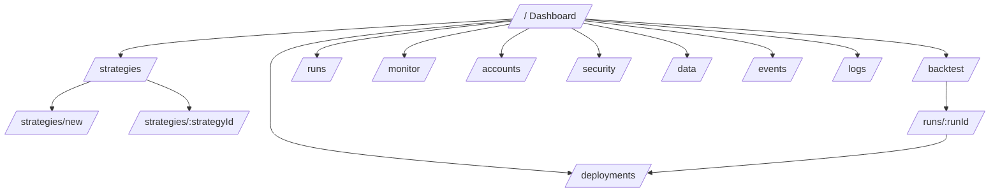
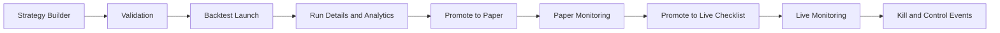
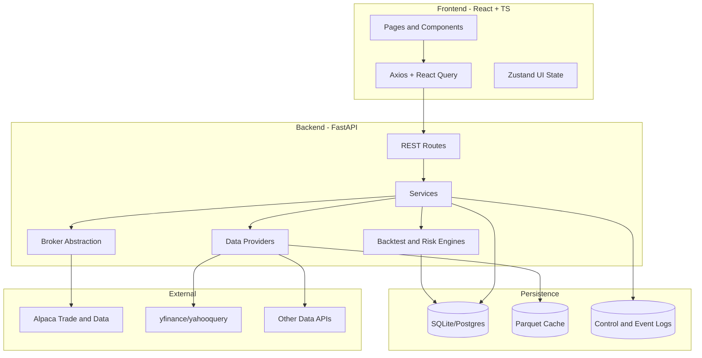
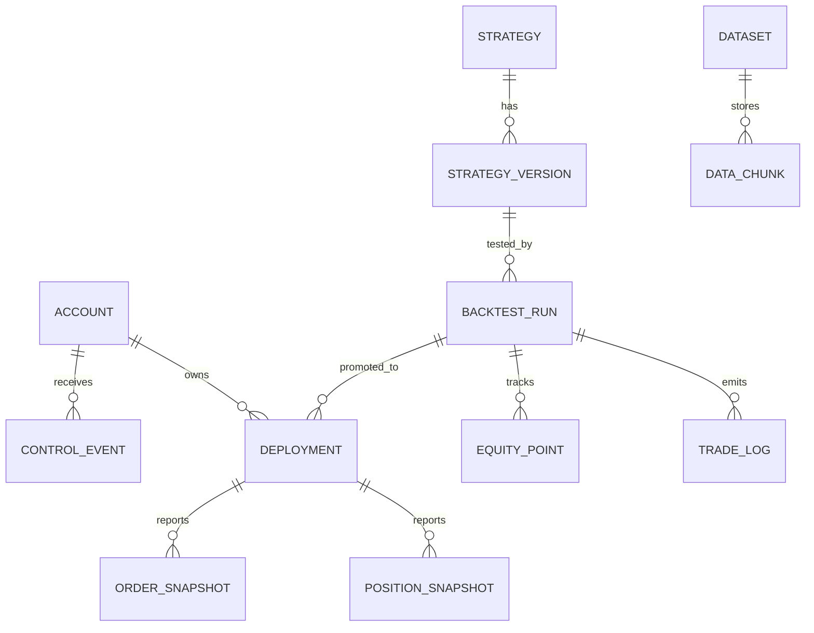

# UltraTrader 2026 - Agent Recreation Blueprint

Version: 1.0  
Date: 2026-04-10  
Audience: UX Lead, Trading Lead, Full-Stack Agent, QA Agent, PM Agent

## 1) Purpose

This document is the single source of truth to recreate the current UltraTrader platform with matching capabilities and visual behavior, then extend it with higher-quality UX and additional free data ingestion options.

Primary objective:
- Reproduce the current product end-to-end: strategy design -> backtest -> paper deploy -> live deploy -> monitor -> controls.

Secondary objective:
- Improve operator UX without reducing safety controls.
- Add free/low-cost market data connectors behind a common provider interface.

Success definition:
- Functional parity with existing flows and APIs.
- Visual parity for layout hierarchy, mode clarity, and safety affordances.
- Better usability metrics (faster task completion, fewer mis-clicks on risky actions).

---

## 2) Product PRD (Consolidated)

### 2.1 Problem Statement

Most retail/prosumer algorithmic traders use fragmented tools for strategy logic, backtesting, broker execution, and monitoring. This increases operational risk, slows iteration, and causes hidden state drift between research and live deployment.

### 2.2 Product Goals

1. Unify the workflow inside one product shell.
2. Keep state and risk highly visible at all times.
3. Make strategy logic explainable and versioned.
4. Enforce safety gates before live deployment.
5. Keep data acquisition reusable, cached, and provider-agnostic.

### 2.3 Users

1. Independent trader (single account, high speed of iteration).
2. Quant developer (strategy logic and analysis depth).
3. Risk-aware operator (monitoring, kill actions, controls).
4. Small desk lead (multi-account supervision).

### 2.4 In-Scope Modules

1. Dashboard
2. Strategy Studio
3. Backtest Launcher and Run Details
4. Data Manager (fetch + cache + inventory)
5. Accounts and Credential Manager
6. Deployment Manager (paper and live promotions)
7. Monitor (positions/orders/PnL)
8. Event Calendar and controls log

### 2.5 Non-Goals (Current Generation)

1. HFT/colocated execution stack.
2. Institutional OMS/EMS replacement.
3. Fully autonomous opaque trading AI.

### 2.6 Functional Requirements

1. Strategy creation with all_of / any_of / n_of_m / not logic.
2. Structure-aware risk rules (ATR, swing, S/R, FVG, fixed).
3. Backtest engine with no-lookahead assumptions.
4. Promotion pipeline: backtest -> paper -> live with checklist gates.
5. Visible kill controls: global and scoped.
6. Account-safe mode distinction: BACKTEST / PAPER / LIVE.
7. Cached market data with overlapping-range augmentation.

### 2.7 Non-Functional Requirements

1. Async-safe backend request handling and background task patterns.
2. Deterministic logging and auditability for critical actions.
3. Cloud-ready container deployment.
4. Configurable persistence (SQLite local, Postgres production).
5. Testing depth on risk, controls, promotions, and broker boundaries.

---

## 3) Full Site Diagram

### 3.1 Information Architecture (Routes)



### 3.2 Workflow Diagram (Trading Lifecycle)



### 3.3 Runtime Architecture Diagram



---

## 4) Look and Feel Recreation Spec

### 4.1 UX Intent

Design tone:
- Professional operator console.
- High signal, low distraction.
- Immediate mode awareness.
- Clear danger semantics for live trading actions.

Interaction priorities:
1. No ambiguous states.
2. Confirmation depth scales with risk.
3. Tables/charts optimized for fast scan.
4. Any critical action must expose context before commit.

### 4.2 Layout Contract

1. Left persistent nav rail.
2. Top header with ModeIndicator + Kill button cluster.
3. Main content uses modular cards and tabbed analytic panels.
4. Dense data tables with sticky headers on core pages.

### 4.3 CSS Token Schema

Implement as CSS variables in a global token file and map into Tailwind config.

```css
:root {
  --bg-page: #030712;
  --bg-surface: #111827;
  --bg-elevated: #1f2937;
  --border-default: #374151;

  --text-primary: #f3f4f6;
  --text-secondary: #d1d5db;
  --text-muted: #9ca3af;

  --brand-primary: #0284c7;
  --brand-primary-hover: #0ea5e9;

  --ok: #34d399;
  --warn: #fbbf24;
  --danger: #f87171;

  --mode-backtest-bg: #064e3b;
  --mode-backtest-fg: #6ee7b7;
  --mode-paper-bg: #312e81;
  --mode-paper-fg: #a5b4fc;
  --mode-live-bg: #7f1d1d;
  --mode-live-fg: #fca5a5;

  --focus-ring: #38bdf8;
  --radius-sm: 6px;
  --radius-md: 10px;
  --radius-lg: 14px;

  --space-1: 4px;
  --space-2: 8px;
  --space-3: 12px;
  --space-4: 16px;
  --space-5: 20px;
  --space-6: 24px;
}
```

### 4.4 Component States Schema

1. Button variants:
- Primary: brand background, clear hover and disabled.
- Secondary: neutral surface, bordered.
- Danger: red background, reserved for irreversible actions.

2. Inputs:
- Default border + muted placeholder.
- Error state includes border + helper text.
- Focus ring always visible for keyboard nav.

3. Badges:
- Status badges for mode/state/risk conditions.
- Use explicit color + icon, not color-only meaning.

4. Table states:
- Loading skeleton.
- Empty state with recovery CTA.
- Error state with retry and reason snippet.

### 4.5 Motion Guidelines

1. Page transitions under 160ms, ease-out.
2. Stagger card reveals on dashboard only.
3. Live danger pulse limited to mode badge and active kill alerts.
4. No decorative animation on core tables/charts.

---

## 5) Data and Contract Schemas

### 5.1 Core Entity Model (Conceptual)



### 5.2 Strategy Configuration Schema (JSON shape)

```json
{
  "name": "string",
  "symbols": ["SPY", "QQQ"],
  "timeframe": "1d",
  "entry": {
    "directions": ["long", "short"],
    "logic": "n_of_m:4",
    "conditions": []
  },
  "stop_loss": {
    "method": "combined",
    "stops": []
  },
  "targets": [
    {"method": "r_multiple", "r": 1.0},
    {"method": "r_multiple", "r": 2.0}
  ],
  "position_sizing": {
    "method": "risk_pct",
    "risk_pct": 1.0
  },
  "risk": {
    "max_position_size_pct": 0.1,
    "max_daily_loss_pct": 0.03,
    "max_drawdown_lockout_pct": 0.1,
    "max_open_positions": 10
  }
}
```

### 5.3 API Surface Baseline

1. Strategies:
- GET /api/v1/strategies
- POST /api/v1/strategies
- POST /api/v1/strategies/validate

2. Backtests:
- POST /api/v1/backtests/launch
- GET /api/v1/backtests/{id}
- GET /api/v1/backtests/{id}/equity-curve
- GET /api/v1/backtests/{id}/trades

3. Deployments:
- POST /api/v1/deployments/promote-to-paper
- POST /api/v1/deployments/promote-to-live

4. Controls:
- POST /api/v1/control/kill-all
- POST /api/v1/control/resume-all

5. Data:
- POST /api/v1/data/fetch
- GET /api/v1/data/inventory

---

## 6) Agent Recreation Specification

### 6.1 Capability Parity Checklist

1. Strategy builder supports nested logic and validation.
2. Backtest run page shows KPIs, equity, drawdown, trades, monthly, Monte Carlo.
3. Promotion flow supports paper then live with checklist gate.
4. Monitoring supports account/deployment/position visibility.
5. Kill operations are auditable and immediate in UI state.
6. Data cache reuses and augments ranges.

### 6.2 Look-and-Feel Parity Checklist

1. Sidebar + header shell layout preserved.
2. Mode indicator always visible and color-consistent.
3. Danger actions grouped and visually distinct.
4. Dense, scan-friendly data tables and dark surfaces.

### 6.3 Implementation Order for an Agent Team

1. Foundation:
- App shell, routing, token system, API client contract.

2. Trading Core:
- Strategy CRUD, validator, backtest launch, run detail tabs.

3. Deployment Safety:
- Promotion APIs, checklist UX, kill controls and logs.

4. Monitoring:
- Live monitor cards/tables, account-level controls.

5. Data Extensibility:
- Provider interface and multi-source ingestion.

6. QA Hardening:
- Regression tests for risk and promotion pathways.

### 6.4 Definition of Done

1. All critical workflows demonstrable in staging.
2. End-to-end tests for strategy -> backtest -> paper -> live -> kill.
3. UI parity signoff by UX lead.
4. Risk controls signoff by trading lead.

---

## 7) UX + Trading Guru Backlog (Enhanced)

Priority keys:
- P0: must-have safety/clarity
- P1: high-value usability
- P2: optimization and scale

### 7.1 P0 Backlog

1. Pre-trade risk preview panel before any promotion.
2. Live-mode friction: two-step typed confirmation for dangerous actions.
3. Context-aware checklist that blocks live promotion on stale data.
4. Unified error taxonomy (data/broker/validation/system) with actionable recovery text.
5. Position-level emergency controls directly in monitor rows.

### 7.2 P1 Backlog

1. Strategy explainability timeline (which rule fired per bar).
2. Compare two backtest runs side-by-side with synchronized charts.
3. Regime overlay on equity curve and trade markers.
4. Progressive disclosure in strategy editor (basic/advanced toggles).
5. Keyboard-first command palette for operators.
6. Quick macros: flatten account, pause deployment, reduce risk by x%.

### 7.3 P2 Backlog

1. Multi-workspace themes (operator, analyst, executive summary).
2. Adaptive table column presets by role.
3. Scenario simulator for slippage and latency stress tests.
4. Lightweight mobile incident mode for kill and status checks.

### 7.4 UX Metrics Targets

1. Time to launch first valid backtest under 4 minutes.
2. Time to locate and flatten a risky deployment under 20 seconds.
3. Promotion abandonment rate due to unclear steps under 5%.
4. User-reported confidence in live-state awareness above 90%.

---

## 8) Free Data Download Options (Additions)

Use all providers through a common interface:
- fetch(symbols, timeframe, start, end, adjusted)
- metadata(source, latency, terms, limits)
- normalize_to_ohlcv(df)

### 8.1 Provider Matrix

| Provider | Asset Classes | Cost Tier | Strengths | Constraints |
|---|---|---|---|---|
| yfinance | Equities, ETFs, some FX/crypto proxies | Free | Easy historical pull, broad symbol coverage | Unofficial endpoint behavior may vary |
| yahooquery | Similar Yahoo universe | Free | Cleaner programmatic access patterns | Same upstream data caveats as Yahoo |
| Stooq CSV | Equities/indices (region dependent) | Free | Simple downloadable history | Inconsistent coverage by market |
| Alpha Vantage | Equities, FX, crypto, indicators | Free tier | Well-documented API | Tight request throttles on free plan |
| Twelve Data | Equities, FX, crypto | Free tier | Multiple intervals and indicators | Free request/day caps |
| Financial Modeling Prep | Equities, fundamentals | Free tier | Fundamentals and profile datasets | Quotas on free plan |
| Tiingo (IEX end-of-day) | US equities EOD | Free tier | Structured EOD endpoint | Requires API key, limited free scope |
| Polygon (free tier) | Equities/crypto (limited) | Free tier | Strong schema consistency | Limited history/features on free |
| Nasdaq Data Link free datasets | Mixed datasets | Free datasets | Diverse macro/alt datasets | Dataset-by-dataset licensing |
| SEC EDGAR | Filings/fundamentals source | Free | Authoritative corporate filing data | Requires parsing and transformation |
| FRED | Macro time series | Free | High quality macro indicators | Not tick-level, macro frequency |

### 8.2 Recommended Integration Order

1. yfinance + yahooquery (already aligned with current stack).
2. Alpha Vantage fallback for specific symbols/timeframes.
3. FRED macro series for event/regime enrichments.
4. SEC EDGAR parser for earnings/fundamentals overlays.

### 8.3 Data Governance Rules

1. Store provider, retrieval timestamp, and adjusted flag on every dataset.
2. Respect provider rate limits with queue/backoff.
3. Persist raw payload hashes for reproducibility checks.
4. Separate licensing-sensitive data from redistributable derived metrics.

---

## 9) Delivery Plan (Agent + Human Collaboration)

### 9.1 Team Roles

1. UX Guru: information architecture, flow friction removal, operator ergonomics.
2. Trading Guru: risk semantics, execution assumptions, control guardrails.
3. Full-Stack Agent: implementation and integration.
4. QA Agent: regression and non-regression around live safety paths.
5. PM Agent: scope hygiene and acceptance tracking.

### 9.2 Sprint Cadence Proposal

1. Sprint 1: shell parity, route parity, baseline API wiring.
2. Sprint 2: strategy and backtest parity.
3. Sprint 3: promotions, monitor, kill controls.
4. Sprint 4: data provider expansion and UX upgrades.
5. Sprint 5: hardening, performance, signoff.

### 9.3 Risk Register

1. Provider reliability drift on free endpoints.
2. UI complexity bloat in Strategy Studio.
3. Safety control discoverability tradeoff with speed.
4. Broker sandbox/live behavior mismatches.

Mitigations:
- Adapter abstraction + health checks.
- UX progressive disclosure and presets.
- Mandatory safety simulations in QA pipeline.
- Broker contract tests for paper/live discrepancies.

---

## 10) Acceptance Test Scenarios

1. Build strategy with n_of_m logic and validate successfully.
2. Run backtest and verify equity, drawdown, trade journal outputs.
3. Promote run to paper and observe deployment creation.
4. Promote paper deployment to live after checklist completion.
5. Trigger kill-all and verify control event persistence.
6. Download data from at least two providers and confirm normalized schema.

---

## 11) Final Build Contract (for Recreation Agent)

When recreating this software, preserve:
1. Workflow topology (strategy -> backtest -> promote -> monitor -> control).
2. Mode safety semantics and visual distinction.
3. Data-provider abstraction and cache-first behavior.
4. Explainability-first strategy and analytics UX.

When extending this software, improve:
1. Promotion clarity and risk preview quality.
2. Operator speed for incident actions.
3. Resilience through multi-provider fallback and governance metadata.
4. Test depth around control and deployment transitions.
